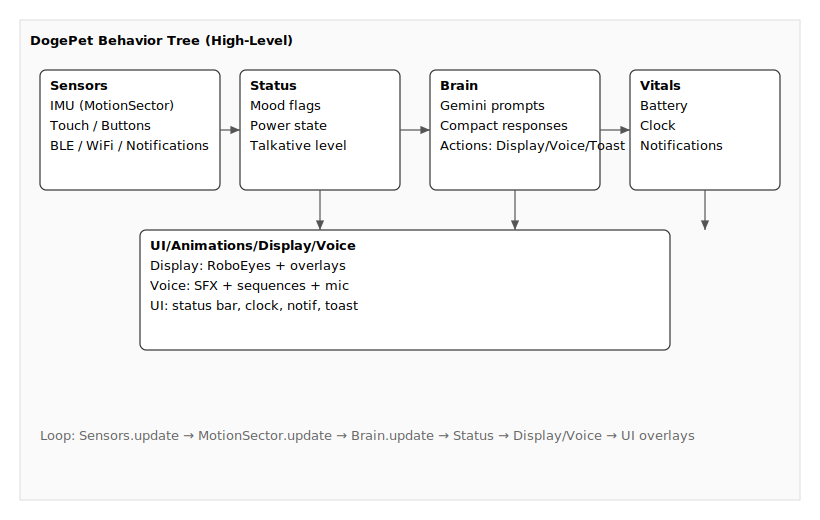

## DogePet — ESP32-S3 Pocket Companion

An expressive ESP32-S3 companion bot with animated RoboEyes, BLE notifications, motion-reactive emotions, optional microphone, and Gemini AI integration — now refactored into a clean, modular Sectors architecture.

## Quick highlights
- MCU: ESP32-S3 Super Mini (tiny, low-power)
- Display: 128×64 SH1106 OLED (I²C)
- Eyes: RoboEyes animations (blink, gaze, moods) via Display sector
- Motion sensing: MPU6050 (accelerometer + gyro) via MotionSector
- Single WS2812 status LED
- BLE + optional WiFi + Gemini AI support
- On-board audio + optional I²S microphone via Voice sector

## Features
- Expressive eye animations (idle, blink, gaze, emotions)
- Touch & button controls to switch modes and toggle BLE/WiFi
- Notification display (BLE notifications shown on the OLED)
- Motion-reactive behaviours (tilt = happy, shake = angry/furious)
- Optional Gemini AI integration for chat-style replies and background "chatter"

## Project structure (important files)
- `DogePet.ino` — main Arduino sketch
- `config.h` — central project configuration (pins, WiFi, Gemini, feature toggles)
- `assets/`, `fonts/`, `include/`, `libraries/` — resources and vendor libs
- `sectors/` — modular sector library:
	- `src/Sectors.h/.cpp` — aggregator with `beginAll()` and `updateAll()`
	- `src/Brain.*` — Gemini AI client and orchestration
	- `src/MotionSector.*` — MPU6050 + motion→mood mapping
	- `src/Display.*` — RoboEyes wrapper and display control
	- `src/Voice.*` — audio engine + microphone utilities
	- `src/Vitals.*` — battery, clock, notifications
	- `src/Sensors.*` — raw sensors plumbed for use across the app
	- `src/UI.*` — UI helpers and rendering glue
	- `src/Status.*` — global bot state (mood, flags)

## Gemini AI (optional)
When enabled, DogePet sends compact prompts to Gemini and receives small structured responses that drive animations, toasts, and sounds via the Sectors.

Enable in `config.h`:

```cpp
// === Gemini AI Configuration ===
static constexpr bool      ENABLE_GEMINI_AI         = true;  // Enable AI features
static constexpr const char* GEMINI_API_KEY         = "your_api_key_here"; // Set your API key here
static constexpr const char* GEMINI_MODEL           = "gemini-2.5-flash";  // Model
static constexpr uint32_t  GEMINI_COOLDOWN_MS      = 45000;                 // Token efficiency
```

Notes:
- Prompt and response budgets are kept short to fit the OLED and save tokens
- Responses map into actions (Display/Voice/Toast) in `sectors/src/Brain.*`
- Background chatter is rate-limited and randomized within a window

## Configuration summary (what to set)
- `ENABLE_WIFI` — required for Gemini AI and background chatter
- `WIFI_SSID`, `WIFI_PASSWORD` — your 2.4GHz network credentials
- `GEMINI_API_KEY` — API key from Google AI Studio
- `GEMINI_MODEL` — pick a model (e.g., `"gemini-2.5-flash"`)

Example WiFi config in `config.h`:
```cpp
static constexpr bool      ENABLE_WIFI              = true;
static constexpr const char* WIFI_SSID              = "your_wifi_network";
static constexpr const char* WIFI_PASSWORD          = "your_wifi_password";
static constexpr uint32_t  WIFI_CONNECT_TIMEOUT_MS = 30000;
```

## Controls & UX
- Touch sensor (TPS223): cycle faces/modes
- FUNC_BTN (active-LOW): short press = action, hold 2s = toggle BLE; double-press = toggle WiFi
- WS2812 LED: shows BLE/WiFi/mood status

Faces / Modes
- Eyes (default): RoboEyes animated, idle wander, blink
- Clock: time/date from BLE ChronosESP32
- Notifications: show last BLE notification with badge for unread

## Wiring (summary)
- OLED SDA/SCL -> pins 9 / 8 (I²C, SH1106 @ 0x3C)
- TPS223 touch -> pin 13 (HIGH on touch)
- FUNC_BTN -> pin 1 (active-LOW)
- WS2812 -> pin 48 (single NeoPixel, 5V with 330Ω inline)
- MPU6050 -> shared I²C (pins 9 / 8)
- I²S Speaker (MAX98357A or similar) -> BCLK=11, LRC=10, DIN=12
- I²S Microphone (optional) -> DI=2, BCLK=11, LRC=10

## Required libraries
- Adafruit_GFX + Adafruit_SH110X
- Adafruit_NeoPixel
- ChronosESP32

Notes:
- RoboEyes is integrated in this repo under `sectors/src/FluxGarage_RoboEyes.h`.
- Other dependencies are vendored in `libraries/`.

## Setup & Flashing
1. Configure `config.h` (pins, WiFi, Gemini, feature toggles).
2. Open `DogePet.ino` in Arduino IDE (ESP32-S3 board package).
3. Build & upload.
4. On first boot the MPU6050 auto-calibrates — keep the device flat & still.

### Using the Sectors library
- Include `#include "sectors/src/Sectors.h"` at the top of `DogePet.ino`.
- In `setup()`, call `Sectors::beginAll(GEMINI_API_KEY)` after hardware init.
- In `loop()`, call `Sectors::updateAll()` to update all modules.
- Optional examples:
	- Set mood: `Sectors::Display::setMood(Sectors::Display::MOOD_HAPPY);`
	- Play sound: `Sectors::Voice::sfxConfirm();`
	- Show clock/notif: handled by `Sectors::Vitals` calls in the sketch

## Troubleshooting
- "AI Init Failed" — verify `GEMINI_API_KEY`, model name, and WiFi connectivity.
- "WiFi Failed" — check SSID/password and that the network is 2.4GHz.
- No AI response — ensure messages respect cooldown and WiFi is on.
- Eyes or audio not working — check Display/Voice sector init and wiring.

## Advanced / Developer notes
- The Brain sector parses compact responses into actions (Display/Voice/Toast)
- Background AI chatter is timed and randomized to reduce usage spikes
- All public behavior is routed through Sectors for easy testing/mocking

## Behavior tree (high-level)



## Animation engine flow (RoboEyes + overlays)


## Privacy & Safety
- API keys and WiFi credentials are stored locally on the device in `config.h`. Keep them secure.
- Communications to Gemini are over HTTPS.
- The firmware does not persist conversation history by default.

## Roadmap
- Expand eye moods (surprised, sleepy) and micro-expressions
- Add on-device voice feedback patterns and sequences
- Conversation memory / personality tuning
- Desktop configuration app

## License
See `LICENSE` in the project root.
